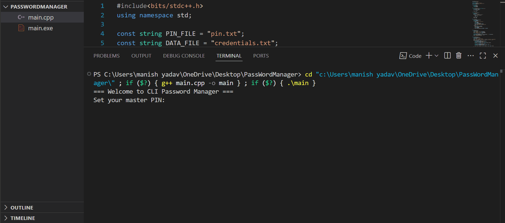

# 🔐 Password Manager (C++ Console App)

A secure and lightweight **Password Manager** built in **C++**, designed for managing your login credentials via the command line. It features **master PIN protection**, **XOR-based encryption**, **random password generation**, and a **password strength checker**.

---
## 📸 Demo




## 🧰 Features

- ✅ **Master PIN Authentication**  
  Only users with the correct master PIN can access the vault.

- 🔐 **Encrypted Credential Storage**  
  Credentials are stored in an encrypted file using XOR cipher.

- 📥 **Add, View & Delete Credentials**  
  Manage multiple login entries with ease.

- 🎲 **Random Password Generator**  
  Generate strong passwords with letters, numbers, and symbols.

- 📊 **Password Strength Checker**  
  Rates password strength as Weak, Moderate, or Strong.

- 💾 **File Handling & Persistence**  
  All data is stored and retained in local files across sessions.

---

## 📁 File Structure
```
/PasswordManager
│
├── main.cpp # Main program logic
├── credentials.txt # Encrypted credentials (auto-generated)
├── pin.txt # Encrypted master PIN (auto-generated)
└── README.md # Project documentation
```

---

## 🚀 Getting Started

### 🧱 Prerequisites
- A C++ compiler (g++, clang++)
- OS: Windows / Linux / macOS

### ⚙️ Compilation

```bash
g++ main.cpp -o password_manager
./password_manager
```
```
🎯 Future Improvements
- Replace XOR with AES encryption
-Use SQLite or JSON/CSV for structured storage
-Add cloud sync using Google Drive or Firebase
-Create a Qt GUI version
-Build a web-based version using Drogon/Crow (C++ Web Framework)


🧑‍💻 Author
Manish Yadav
Open to contributions, feedback, and forks!
